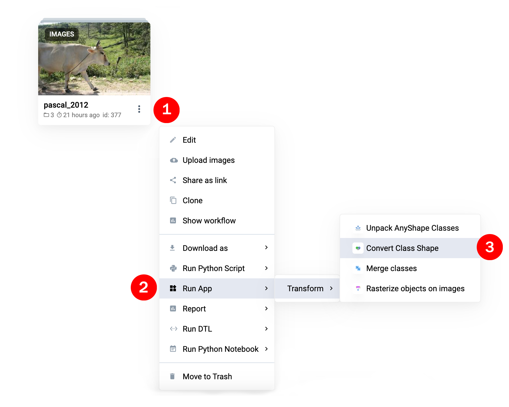
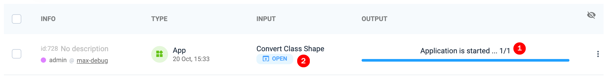
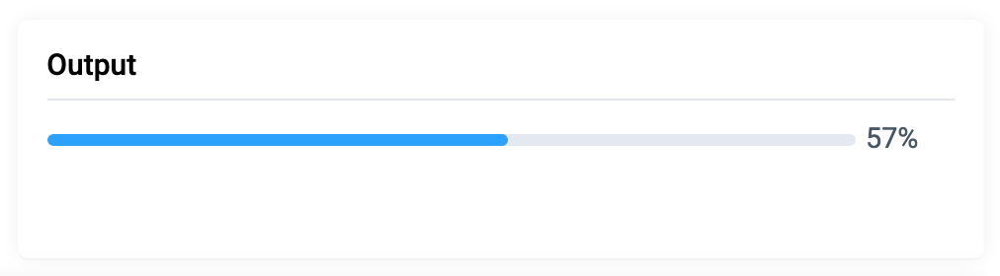
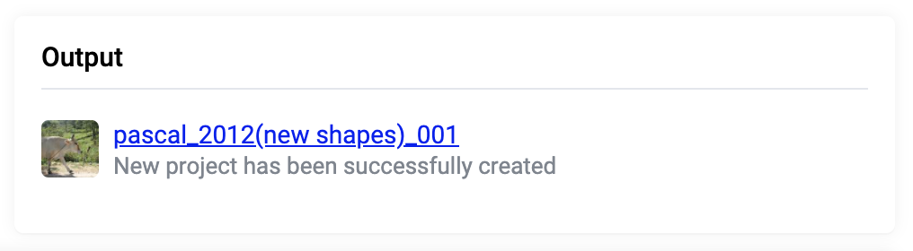

 

# Convert Class Shape
  

  <a href="#Overview">Overview</a> •
  <a href="#How-To-Run">How To Run</a>

 

## Overview 
It is often needed to convert labeled objects from one geometry to another while doing computer vision reseach. There are huge number of scenarios , here are some examples:
- you labeled data with polygons to train semantic segmentation model, and then you decided to try detection model. Therefore you have to convert your labels from polygons to rectangles (bounding boxes)
- or you applied neural network to images and it produced pre-annotations as bitmaps (masks). Then you want to transform them to polygons for manual correction.

This app covers following transformations:
- from `Bitmap` to `Polygon`, `Rectangle` and `AnyShape`
- from `Polygon` to `Rectangle`, `Bitmap` and `AnyShape`
- from `Polyline` to `Rectangle`, `Bitmap`, `Polygon`, `AnyShape`
- from `Rectangle` to `Polygon`, `Bitmap` and `AnyShape`
- from `Graph` (i.e. `Keypoints`) to `Rectangle` and `AnyShape`
- from `Point` to `AnyShape`
- `Cuboid`, `Cuboid3d`, `Pointcloud` (segmentation of point clouds), `Point3d` are not supported yet (send us a feature request if you need it)

Notes:
- Result project name = original name + "(new shapes)" suffix
- Your data is safe: app creates new project with modified classes and objects. The original project remains unchanged
- Before converting `AnyShape` classes, you have to unpack it with another app - [Unpack Anyshape](https://github.com/supervisely-ecosystem/unpack-anyshape) 
- Colors of new classes will be generated randomly
- Note: transformation from raster (bitmap) to vector (polygon) will result in huge number of points. App performs approximation to reduce the number. That can lead to slight loss of accuracy at borders. Special settings to control approximation will be released in next version.

## How To Run

### Step 1: Run from context menu of project

Go to "Context Menu" (images project) -> "Run App" -> "Transform" -> "Convert Class Shape"

### Step 2:  Waiting until the app is started
Once app is started, new task appear in workspace tasks. Wait message `Application is started ...` (1) and then press `Open` button (2).

### Step 3: Define transformations

App contains 3 sections: information about input project, information about output and the list of all classes from input project. In column `CONVERT TO` there are dropdown lists in front of each class (row of the table). You have to define transformations for classes of interest. 

Default `remain unchanged` option is selected and means that class and all its objects will be copied without modification to a new project. Dropdown lists only contain allowed shapes (see <a href="#Overview">Overview</a>), for example `Rectangle` can not be transformed to `Polyline` or `Point`. 

### Step 4: Press RUN button and wait

Press `Run` button. The progress bas will appear in `Output` section. Also you can monitor progress from tasks list of the current workspace.

App creates new project and it will appear in `Output` section. Result project name = original name + "(new shapes)" suffix.

### Step 5: App shuts down automatically

Even if app is finished, you can always use it as a history: open it from tasks list in `Read Only` mode to check Input project, list of applied transformations and Output project. 
